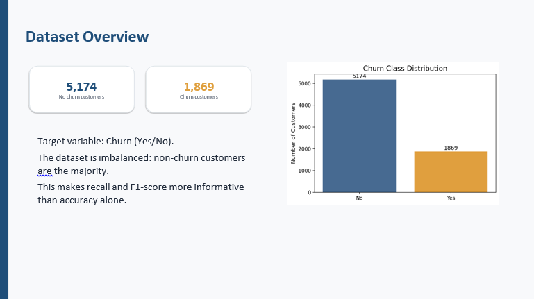
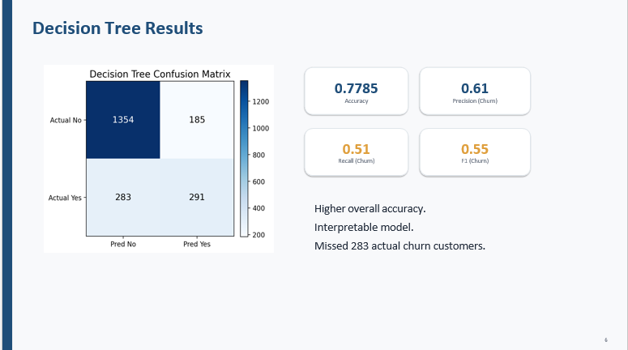
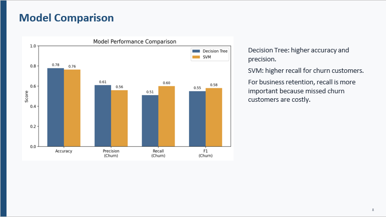
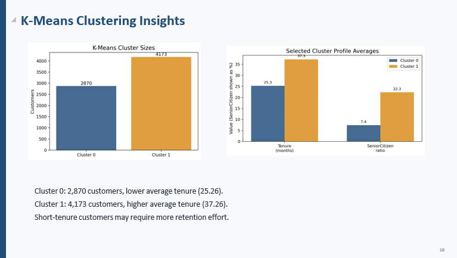

# 📊 Telecom Customer Churn Prediction Using Machine Learning

[cite_start]An end-to-end data mining and machine learning project focused on predicting telecom customer retention[cite: 7, 8]. [cite_start]This project implements a comprehensive pipeline from data preprocessing to model evaluation and customer segmentation using both supervised and unsupervised learning techniques[cite: 9, 15, 17].

---

## 👥 Project Team & Context
* [cite_start]**Done by:** Mohammad Al-Omari & Asem Jabri [cite: 11]
* [cite_start]**Supervised by:** Dr. Bashar Tahaineh [cite: 12]
* [cite_start]**Term:** Final Project - Spring 2026 [cite: 10]
* [cite_start]**Domain:** Data Mining & Machine Learning [cite: 10]

---

## 🎯 Project Objective
[cite_start]The primary goal is to analyze historical customer behavior data to predict whether a telecom customer will churn (leave the company) or stay[cite: 14]. By detecting at-risk customers early, businesses can deploy proactive retention strategies to minimize financial loss.

---

## 📊 Dataset Overview
[cite_start]The project analyzes a dataset containing **7,043 customer records** with **21 distinct attributes**[cite: 1, 5, 6].
* [cite_start]**Target Variable:** `Churn` (Yes / No)[cite: 29].
* [cite_start]**Class Distribution:** [cite: 25, 27]
  * [cite_start]**5,174** Non-churn customers (Majority class)[cite: 25, 26, 30, 31].
  * [cite_start]**1,869** Churn customers (Minority class)[cite: 27, 28].
* [cite_start]**Key Challenge:** The dataset is imbalanced, making metrics like Recall and F1-score highly critical for reliable performance evaluation compared to raw accuracy alone[cite: 30, 32].



---

## ⚙️ Data Preprocessing Pipeline
To prepare the data for the machine learning algorithms, the following preprocessing steps were applied:
1. [cite_start]**Identifier Removal:** Removed `customerID` as it holds no predictive power[cite: 34].
2. [cite_start]**Target Mapping:** Mapped the target variable `Churn` into numerical values (`Yes = 1`, `No = 0`)[cite: 34].
3. [cite_start]**Feature Conversion:** Transformed `TotalCharges` into numeric values before dummy encoding[cite: 37, 38].
4. [cite_start]**Categorical Encoding:** Converted all categorical features using **One-Hot Encoding**[cite: 35, 36].
5. [cite_start]**Feature Scaling:** Applied `StandardScaler` to normalize numerical fields, which is essential for distance-based and boundary-based models (SVM and K-Means)[cite: 37].
6. [cite_start]**Data Splitting:** Divided the processed dataset into **70% Training data** and **30% Testing data** using `random_state = 42` for experimental reproducibility[cite: 47, 49, 50, 53].

---

## 🧠 Implemented Models & Performance

[cite_start]The project evaluates and compares two supervised classification models alongside an unsupervised clustering approach[cite: 17].

### 1. Decision Tree Classifier
* [cite_start]**Pros:** Highly interpretable model with the highest overall accuracy[cite: 68].
* [cite_start]**Cons:** Prone to missing actual churn cases (higher False Negatives, missed 283 actual churn cases)[cite: 69].
* **Metrics:**
  * [cite_start]**Accuracy:** 77.85% [cite: 60, 61]
  * [cite_start]**Precision (Churn):** 0.61 [cite: 63]
  * [cite_start]**Recall (Churn):** 0.51 [cite: 64, 65]
  * [cite_start]**F1-Score (Churn):** 0.55 [cite: 66, 67]



### 2. Support Vector Machine (SVM)
* [cite_start]**Pros:** Successfully identified more true churn customers (Lower False Negatives: 231 compared to Decision Tree's 283)[cite: 80].
* [cite_start]**Cons:** Slightly lower overall precision[cite: 74, 84].
* **Metrics:**
  * [cite_start]**Accuracy:** 76.43% [cite: 72, 73]
  * [cite_start]**Precision (Churn):** 0.56 [cite: 74, 75]
  * [cite_start]**Recall (Churn):** 0.60 [cite: 76, 77]
  * [cite_start]**F1-Score (Churn):** 0.58 [cite: 78, 79]


### 📈 Model Comparison Summary
[cite_start]For business retention goals, **Recall is the priority metric**[cite: 86]. [cite_start]Missing a customer who is about to leave (False Negative) is highly costly to the company[cite: 86, 109]. [cite_start]Therefore, **Support Vector Machine (SVM) is the recommended model** as it achieves a superior churn recall of **60%**[cite: 81, 118, 120, 125].



### 🔍 Feature Importance Analysis
[cite_start]Using the Decision Tree's `feature_importances_` attribute, the strongest predictors driving customer churn were identified as: [cite: 93, 127, 128]
* [cite_start]**Tenure:** Current customer loyalty duration[cite: 89, 90].
* [cite_start]**Contract Type:** Long-term commitment vs. month-to-month billing[cite: 91, 92].
* [cite_start]**Charges:** Monthly billing behavior[cite: 94, 95].
* [cite_start]**Service Quality:** Internet service types and tech support availability[cite: 96, 97].

---

## 👥 Customer Segmentation (K-Means Clustering)
[cite_start]An unsupervised **K-Means Clustering** analysis was integrated to uncover distinct customer behavioral groups[cite: 17, 112]:
* [cite_start]**Cluster 0 (2,870 Customers):** Characterized by a lower average tenure (~25.26 months)[cite: 103]. [cite_start]These short-tenure customers represent a high-risk segment requiring immediate retention focus[cite: 104].
* [cite_start]**Cluster 1 (4,173 Customers):** Characterized by a higher average tenure (~37.26 months) and a higher ratio of Senior Citizens (22.3%)[cite: 102, 104].




---


## 📊 Dataset Overview
The dataset used in this project was sourced from **Kaggle** (specifically the classic Telco Customer Churn dataset). It contains **7,043 customer records** with **21 distinct attributes**.

* **Target Variable:** `Churn` (Yes / No).
* **Class Distribution:**
  * **5,174** Non-churn customers (Majority class).
  * **1,869** Churn customers (Minority class).
* **Key Challenge:** The dataset is imbalanced, making metrics like Recall and F1-score highly critical for reliable performance evaluation compared to raw accuracy alone.


## 🚀 Future Enhancements
* [cite_start]Implement hyperparameter tuning (GridSearchCV) to optimize model parameters[cite: 123].
* [cite_start]Apply class imbalance correction techniques like **SMOTE** or adjusted class weights[cite: 123].
* Explore ensemble methods such as **Random Forest** or **XGBoost** to boost overall precision and recall balance.

---

## 📂 Project Structure
```text
├── data/                     # Contains the telecom dataset
├── notebooks/                # Jupyter Notebooks with full Python code
├── plots/                    # Confusion matrices and performance comparison charts
└── README.md                 # Project documentation